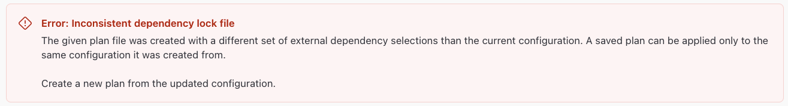

# tf-lock-fun

A project to experiment with Terraform state locking mechanisms and highlight potential issues and solutions.

## Challenge

There is a case where we can experience an error related to Terraform state locking when the private registry is updated between a plan and apply in a Workspace Run.

### Prerequisites

We can use the [taskfile](https://taskfile.dev/) in this repo and [tfx](https://tfx.rocks/) to reproduce the issue.

### Reproduce

The following steps can be followed to reproduce the issue:

- Upload Public GPG Key to the Registry.
  - `task pr:upload-gpg-key`
- Create a Provider in the Registry, name: "random".
  - `task pr:create`
- Create a Version of the "random" provider, version: "3.7.2", with a SHA256SUMS file that includes platforms for Linux/Darwin & amd64/arm64 platforms.
  - `task pr:create:select`
- Upload Provider Version Platforms of Linux/amd64 and Darwin/amd64.
  - `task pr:binaries`
- Create a new Workspace with the Terraform in the `workspace/` folder.
- Run `terraform apply` in the Workspace, let the plan finish, but do not apply yet.
- Delete the "random" Provider Version "3.7.2" from the Registry.
  - `task pr:delete`
- Create a Version of the "random" provider, version: "3.7.2", with a SHA256SUMS file that includes all platforms.
  - `task pr:create:all`
- Upload Provider Version Platforms of Linux/amd64 and Darwin/amd64.
  - `task pr:binaries`
- Go back to the Workspace and apply the plan. You should see the error related to "
Error: Inconsistent dependency lock file".

View the taskfile for more details on the commands.
